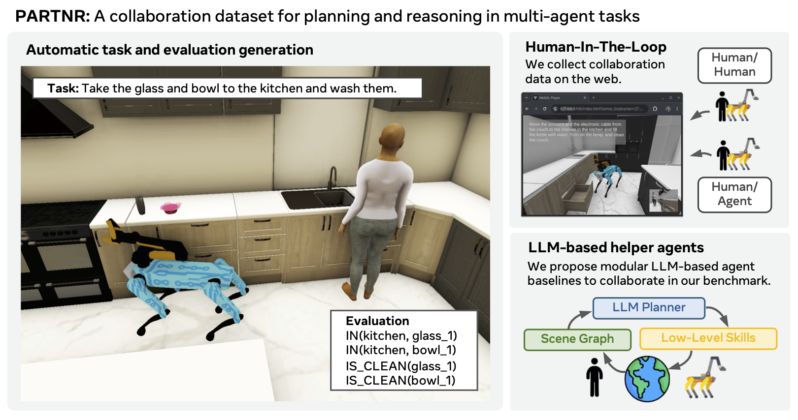
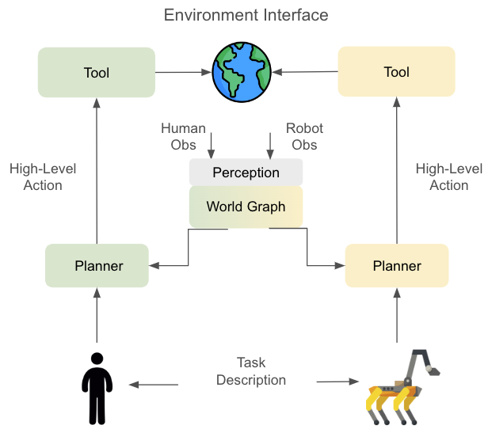

# PARTNR: A Benchmark for Planning and Reasoning in Embodied Multi-Agent Tasks

This is the official repository for the PARTNR benchmark. It includes instructions for downloading and running the PARTNR benchmark in the Habitat simulator and implements Large Language Model (LLM) based planners as baselines.

[Project Website](https://aihabitat.org/partnr/) | [Paper](https://arxiv.org/pdf/2411.00081)



## Overview

This codebase contains abstractions for enabling agents to follow free form natural language instructions in the Habitat simulator. The main abstractions are - **Agent**, **Planner**, **Tool**, and **Skill**. The agent has access to a set of tools which can allow it to perceive the state of the environment, or interact with the environment using low level skills. This repository also contains  the codebase for generating PARTNR datasets using LLMs.

## Citing PARTNR

If you use our codebase or dataset in your research, please cite the [PARTNR](https://arxiv.org/pdf/2411.00081) paper:

```
@misc{chang2024partnrbenchmarkplanningreasoning,
      title={PARTNR: A Benchmark for Planning and Reasoning in Embodied Multi-agent Tasks}, 
      author={Matthew Chang and Gunjan Chhablani and Alexander Clegg and Mikael Dallaire Cote and Ruta Desai and Michal Hlavac and Vladimir Karashchuk and Jacob Krantz and Roozbeh Mottaghi and Priyam Parashar and Siddharth Patki and Ishita Prasad and Xavier Puig and Akshara Rai and Ram Ramrakhya and Daniel Tran and Joanne Truong and John M. Turner and Eric Undersander and Tsung-Yen Yang},
      year={2024},
      eprint={2411.00081},
      archivePrefix={arXiv},
      primaryClass={cs.RO},
      url={https://arxiv.org/abs/2411.00081}, 
}
```

## Code Organization

Below are the details of various important directories and classes.

- **habitat-llm**
    - **Agent**   : Represents the robot or human. An agent can act in the environment.
    - **Tools**   : Represents abstractions which enable the agent to perceive or act in the environment.
    - **Planner** : Represents centralized and decentralized planners.
    - **LLM**     : Contains abstractions to represent Llama and GPT APIs.
    - **WorldGraph** : Contains a hierarchical world graph representing rooms, furniture, objects.
    - **Perception** : Contains a simulated perception pipeline which sends local detections to the world model.
    - **Examples**: Contains demos and evaluation programs to show or analyze the performance of planners.
    - **EvaluationRunner**: Represents an abstraction for running the planners.
    - **Conf**    : Contains hydra config files for all classes.
    - **Utils**   : Contains various utility methods required throughout the codebase.
    - **Tests**   : Contains unit tests.
- **scripts**
    - **hitl_analysis** : Contains scripts to analyze and replay human-in-the-loop traces.
    - **prediviz** : Contains visualization and annotation tools for PARTNR tasks.


## Information Flow

Below is a figure showing the flow of information through decentralized planners in PARTNR. Please note that at there is no explicit communication between the two decentralized planners. The [EnvironmentInterface](./habitat_llm/agent/env/environment_interface.py) reads observations for each agent and sends them to the [Perception Module](./habitat_llm/perception/perception_sim.py). The processed observations are used to update the [World Graph](./habitat_llm/world_model/world_graph.py) and the [Planner](./habitat_llm/planner/planner.py) (based on an LLM or other system) uses the world graph and the task description select a [Tool](./habitat_llm/tools/tool.py) to interact with the environment.

<p align="center">
  
</p>

## Installation

For installation, refer to [INSTALLATION.md](INSTALLATION.md)

## Quickstart

Baselines for a variety of agent configuration are runnable with the provided configurations. Select any of the baselines from [habitat_llm/conf/baselines](./habitat_llm/conf/baselines/). You may need to specify one or two LLMs based on the baseline. Set the inference mode to `hf` and specify the huggingface model to use for inference. Model weights will be downloaded automatically if they are not found. Below are examples using Llama-3.1-8B running on the `val_mini` data split. Replace `val_mini` with one of `[train_2k, val, train, val_mini]` to run other splits.

### Decentralized Multi Agent React Summary
```bash
python -m habitat_llm.examples.planner_demo --config-name baselines/decentralized_zero_shot_react_summary.yaml \
    habitat.dataset.data_path="data/datasets/partnr_episodes/v0_0/val_mini.json.gz" \
    evaluation.agents.agent_0.planner.plan_config.llm.inference_mode=hf \
    evaluation.agents.agent_1.planner.plan_config.llm.inference_mode=hf \
    evaluation.agents.agent_0.planner.plan_config.llm.generation_params.engine=meta-llama/Meta-Llama-3-8B-Instruct \
    evaluation.agents.agent_1.planner.plan_config.llm.generation_params.engine=meta-llama/Meta-Llama-3-8B-Instruct
```

### Centralized Multi Agent React Summary
```bash
python -m habitat_llm.examples.planner_demo --config-name baselines/centralized_zero_shot_react_summary.yaml \
    habitat.dataset.data_path="data/datasets/partnr_episodes/v0_0/val_mini.json.gz" \
    evaluation.planner.plan_config.llm.inference_mode=hf \
    evaluation.planner.plan_config.llm.generation_params.engine=meta-llama/Meta-Llama-3-8B-Instruct
```

### Single Agent React Summary
```bash
python -m habitat_llm.examples.planner_demo --config-name baselines/single_agent_zero_shot_react_summary.yaml \
    habitat.dataset.data_path="data/datasets/partnr_episodes/v0_0/val_mini.json.gz" \
    evaluation.agents.agent_0.planner.plan_config.llm.inference_mode=hf \
    evaluation.agents.agent_0.planner.plan_config.llm.generation_params.engine=meta-llama/Meta-Llama-3-8B-Instruct
```

### Heuristic Planner
```bash
python -m habitat_llm.examples.planner_demo --config-name baselines/heuristic_full_obs.yaml \
    habitat.dataset.data_path="data/datasets/partnr_episodes/v0_0/val_mini.json.gz"
```
### Custom Instructions

In addition to the PARTNR splits you can run custom instructions as well. Below is an example running a custom instruction using single agent react.

```bash
python -m habitat_llm.examples.planner_demo --config-name baselines/single_agent_zero_shot_react_summary.yaml \
    instruction="<CUSTOM_INSTRUCTION>" \
    mode='cli' \
    evaluation.agents.agent_0.planner.plan_config.llm.inference_mode=hf \
    evaluation.agents.agent_0.planner.plan_config.llm.generation_params.engine=meta-llama/Meta-Llama-3-8B-Instruct
```

### OpenAI Backend
To run with openai chat as the LLM backed instead set the `plan_config.llm=openai_chat`. Make sure your API keys have been set appropriately.
```bash
python -m habitat_llm.examples.planner_demo --config-name baselines/single_agent_zero_shot_react_summary.yaml \
    habitat.dataset.data_path="data/datasets/partnr_episodes/v0_0/val_mini.json.gz" \
    llm@evaluation.agents.agent_0.planner.plan_config.llm=openai_chat
```
Note that constrained generation is not supported for the openai backend.

### Learned Skills
To run baselines with neural network skills for the robot agent (point nav, pick, and place) append the following argument overrides to the above commands. Please refer to the installation readme to download the skill checkpoints.

```bash
    device=cpu \
    agent@evaluation.agents.agent_0.config=nn_rearrange_agent_motortoolsonly \
    habitat_conf/task=rearrange_easy_multi_agent_nn \
```

## Calculating Results
You can check the progress of the run and the results so far using
`python scripts/read_results.py <output_dir>/<dataset_name>`. The default `output_dir` is `outputs/habitat_llm/<timestamp>-<dataset_name>`. This can be overridden using the `paths.results_dir` and `evaluation.output_dir` configuration elements. The output directory also contains the full text traces of the rollouts and other statistics.

## Testing episodes

To test whether a dataset is runnable and the success at step 0, run the following command. Set the `habitat.dataset.data_path` to the dataset you want to test.

```bash
HYDRA_FULL_ERROR=1 python -m habitat_llm.examples.verify_episodes \
    --config-name examples/planner_multi_agent_demo_config.yaml \
    hydra.run.dir="." \
    evaluation=centralized_evaluation_runner_multi_agent \
    habitat.dataset.data_path="data/datasets/partnr_episodes/v0_0/val_mini.json.gz" \
    mode='data' \
    world_model.partial_obs='False' \
    evaluation.type="centralized" \
    num_proc=5
```

#### SkillRunner: Running Oracle Skills in a Sandbox Environment

The habitat_llm/examples/skill_runner.py application provides a headless command line interface (CLI) for running custom sequences of oracle skills within a sandbox environment for a given episode.

For example:
```bash
HYDRA_FULL_ERROR=1 python -m habitat_llm.examples.skill_runner hydra.run.dir="." +skill_runner_show_topdown=True habitat.dataset.data_path=data/datasets/partnr_episodes/v0_0/val_mini.json.gz +skill_runner_episode_id="334"
```
In the above example, episode `334` from the `val_mini.json.gz` dataset will be instantiated, the list of all active Entities (Rooms, Objects, Furniture, and Receptacles) will be printed to the console.

- By providing CLI option `+skill_runner_show_topdown=True`, the program will render and display a top-down view of the scene upon initialization.

- CLI option `+skill_runner_episode_index=` can be provided instead of `+skill_runner_episode_id=`, in which case the integer index will be used to query the episode from the dataset.

- Note that all environment config values can be overridden from the CLI and defaults are set in `habitat_llm/conf/examples/skill_runner_default_config.yaml`.

Once the Episode is initialized, the user will be presented with a list of available skills (e.g. Navigate, Pick, Place, Open, Close) and prompted to enter a command.

Commands can take the form of a skill call, for example:
```bash
Enter Command
> Navigate 0 table_10
```
would command agent 0 to execute the "OracleNavSkill" targeting Entity with name `table_10`. By default, a video of the full skill execution will be produced and displayed after skill completion along with skill output text printed to the console.

- All generated video will be saved to `paths.results_dir`, change this path by adding `paths.results_dir=<relative_path_to_directory>` to the CLI call.
- Video recording and playback can be disabled by setting `+skill_runner_make_video=false` in the CLI.

_NOTE: skill_runner currently supports only sequential skill execution for one agent at a time. For example, you cannot command both agents to simultaneously navigate. Primarily this restriction is motivated by the complexity of synchronizing skills with different execution lengths._

Additional non-skill commands include:
- `debug` - trigger a pdb breakpoint for open-ended debugging and attach a `DebugVisualizer` to local variable `dbv` for visual debugging.
- `exit` - quit the program.
- `help` - print the available skill text to the console.
- `entities` - print the list of available entities to the console.
- `make_video` - generate, display, and save a concatenation of all sequential skill execution videos.

## Using with ConceptGraphs

See detailed doc [here](./habitat_llm/concept_graphs/README.md)

## Finetuning a planning model

See detailed doc [here](./habitat_llm/finetuning/README.md)

## Extending the environment

For additional details about adding new agents, tools and custom actions see [here](./docs/extending.md)


## License

partnr-planner is MIT licensed. See the [LICENSE](LICENSE) for details.
