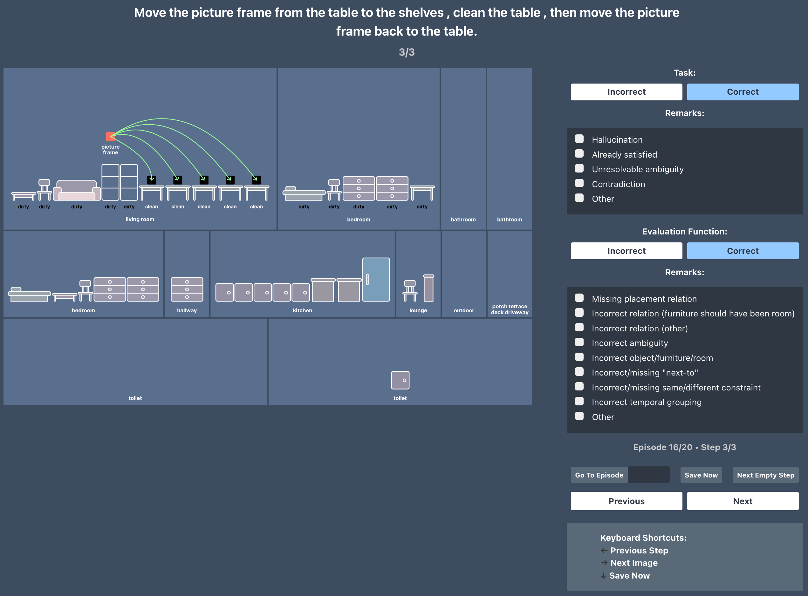
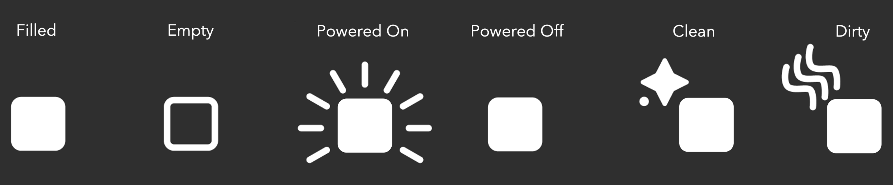
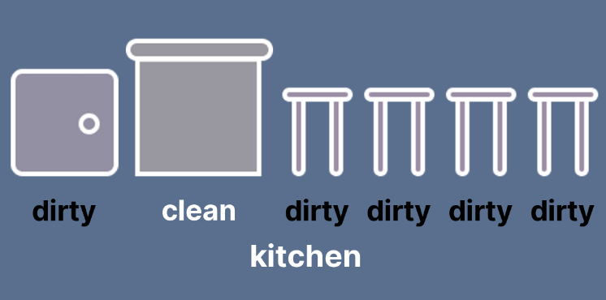
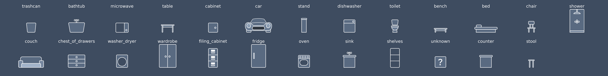

# PrediViz: Visualization and Annotation for PARTNR



PrediViz is a visualization and annotation system for PARTNR tasks. The visualization shows the configuration of objects, furniture, and rooms along with the associated task instruction and evaluation function. The 2D illustration style captures the relevant structure of the data in a simplified, efficient medium meant for rapid human understanding of the scene, task, and evaluation function. Here, we describe how to run generate PrediViz visualizations for a dataset, how to interpret the visualizations, and how to run the annotation tool.

## Generating PrediViz Visualizations

To generate PrediViz images for a given dataset, metadata must first be extracted:

```bash
python dataset_generation/benchmark_generation/metadata_extractor.py \
    --dataset-path <the .json.gz PARTNR dataset to load> \
    --scene-metadata-cache <Optional:, save scene info files to a cache directory. If the cache already exists, loads scene infos from it> \
    --save-dir <directory to save the resulting metadata files>
```

Then, generate the image frames:

```sh
python scripts/prediviz/viz.py \
    --dataset <path to the json file> \
    --metadata-dir <path to the directory containing episode metadata> \
    --save-path <directory that stores the visualizations>
```

Required Arguments:

- `--dataset`: the path to the dataset file in either `.json` or `.json.gz` format.
- `--metadata-dir`: the path to the directory containing the episode metadata JSON files for the dataset specified by `--dataset`.
- `--save-path`: the path to the directory in which to save visualizations. Creates the directory if it does not exist.

Optional Arguments:

- `--episode-id`: If specified, generates a visualization for just the provided episode ID. Default: None.
- `--sample-size`: If non-zero, will generate visualizations of a random subset of episodes. Default: 0 (generates visualizations for all episodes)

## PrediViz for Data Annotation

PrediViz can be used to manually annotate the correctness and failure modes of generated PARTNR tasks. Task correctness and evaluation correctness can be annotated, along with a set of common failure modes for each. To run a data annotation trial, first generate a set of visualizations using the steps above.

### Create Annotation Trials

To create the annotation trials:

```sh
python scripts/prediviz/scripts/create_samples.py \
    --viz-dir <path to the directory of prediviz visualizations> \
    --sample-size <number of samples to produce annotation trials for>
```

Required Arguments:

- `--viz-dir`: the path to the directory of PrediViz visualizations.

Optional Arguments:

- `--sample-size`: If non-zero, will generate visualizations of a random subset of episodes. Default: 0 (generates visualizations for all episodes)
- `--num-directories`: How many annotation directories to produce
- `--overlap-samples`: How many samples should be shared across annotation directories

This will create sample directories (`sample_[n]`) which can be shared with annotators:

```sh
[viz-dir]/
├── sample_0
│   ├── README.md
│   ├── assets
│   │   ├── viz_0.png
│   │   ├── viz_1.png
│   │   └── viz_2.png
│   ├── image.png
│   ├── interface.html
│   ├── receptacle_collage.png
│   └── sample_episodes.json
│   └── server.py
```

### Perform Annotations

To perform annotations, run the web server, mark your annotations, and save the results.

To run the web server for a given `viz-dir` and sample directory number `n`:

```sh
python [viz-dir]/sample_[n]/server.py
```

By default `--port 8888` is used. To specify a different port, use `--port <port-number>`.

Using the interface, an `annotations.json` will be saved in the sample directory. This file contains the annotations for each step in each episode in the sample.

### Analyze Annotation Results

Once an annotation file has been produced, calculate correctness scores:

```sh
python scripts/prediviz/scripts/calculate_correctness_scores.py \
    --annotation-file <path-to-sample_[n]/annotations.json>
```

This file calculates correctness scores both episode-wise and step-wise (each temporal frame). An episode must have both task and evaluation correctness annotated to be considered. The output includes:

- `task_correctness`: the percentage of steps where the task was correctly annotated.
- `evaluation_correctness`: the percentage of steps where the evaluation was correctly annotated ONLY when the corresponding task was marked correct.

The top 3 most common failure modes (if annotated) for each task and evaluation correctness are shown beneath.

## Interpreting PrediViz Visualizations

### Object and Furniture States

The affordances supported in PrediViz include:

```text
clean vs dirty
powered_on vs powered_off
filled vs empty
```

For objects, states are shown as icon overlays surrounding the object. If the state is a default value (dirty, powered_off, empty), no overlay is shown.

<div style="text-align:left"></div>

For furniture, states are specified in text beneath the furniture:

<div style="text-align:left"></div>

### Furniture Categories

The core set of supported furniture icons is as follows:


