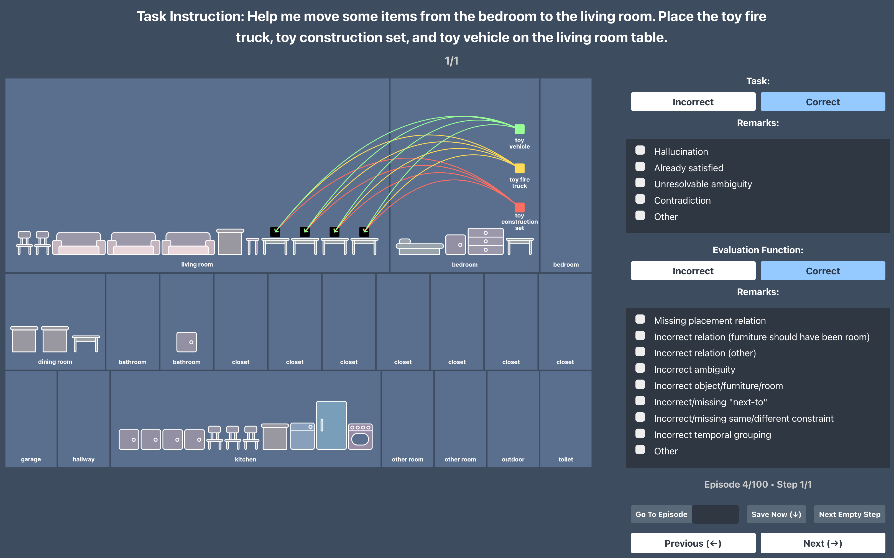
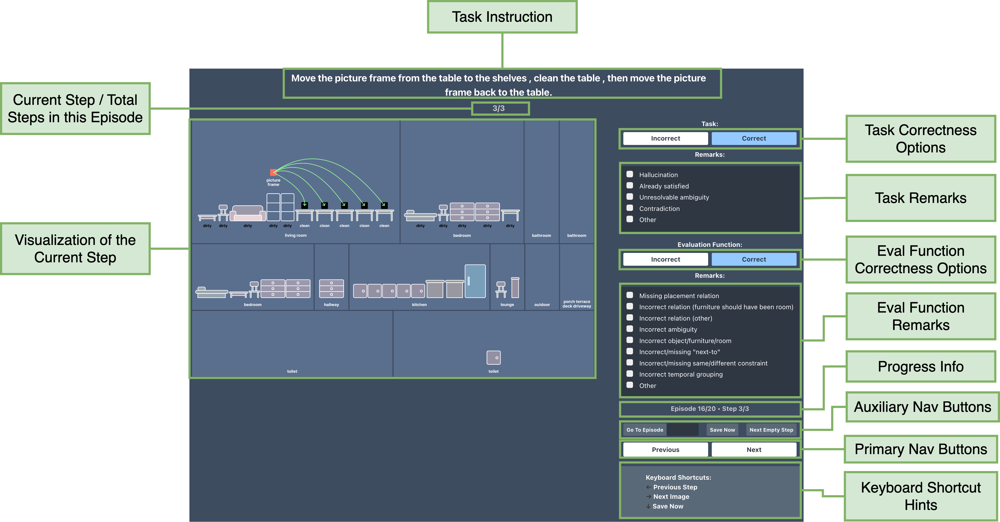
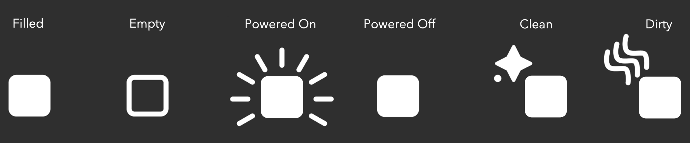
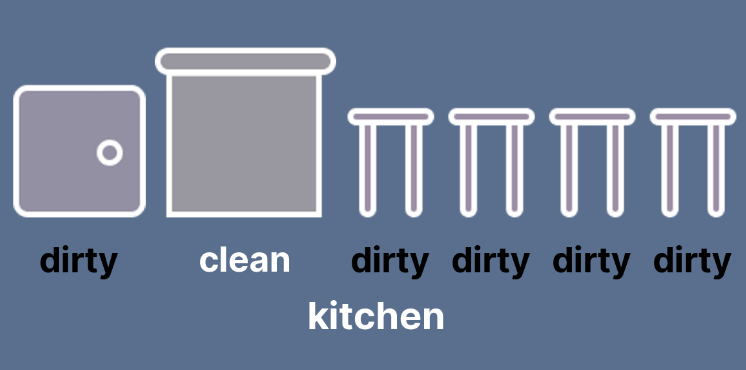

# Annotation Tool User Guide

This annotation tool allows a user to evaluate the correctness of a batch of PARTNR tasks and evaluation functions. It wraps already-generated PrediViz visualizations in a web-based tool where the user can independently annotate task and evaluation correctness as well as annotate the failure modes:



## Structure

The sample directory is arranged as follows:

```sh
.
├── README.md
├── annotation_tool.png
├── assets
│   ├── viz_0
│   │   ├── step_0.png
│   │   ├   ...
│   │   └── step_n.png
│   .
│   .
│   ├── viz_1
│   │   ├── step_0.png
│   │   ├   ...
│   │   └── step_n.png
│   ├   ...
│   ├── viz_n
│   │   ├── step_0.png
│   │   ├   ...
│   │   └── step_n.png
├── interface.html
├── README.md
├── receptacle_collage.png
├── sample_episodes.json
└── server.py
```

- The assets contain the visualizations for the sample of episodes. Note that the number in `viz_<>` represents the sample index in `sample_episodes.json`.
- Visualizations have multiple steps (frames) when the evaluation function dictates temporal order.
- The `sample_episodes.json` contains the LLM generated propositions and constraints which were used to create the visualizations.
- The `interface.html` is the HTML interface for annotation.

## Instructions

### Running the annotation tool

- In order to run the annotation tool, run the server script:

  ```sh
  python <path to the sample directory>/server.py
  ```

  You can provide a different port number using `--port` flag. The default port is `8888`.
  Running this script will spawn the annotation tool at `http://localhost:<port>` on your default browser.

### How to use the annotation tool



- **Task Instruction**: The task instruction is displayed at the top of the interface. This is the instruction that the agent will receive. This instruction may have step-wise information (i.e. First do X, then do Y).

- **Current Step/Total Steps**: Just below the task instruction, you will see the current step number and the total number of steps in the episode. This is useful to keep track of the step you are currently annotating, and whether there are more steps to come.

- **Visualizations**: The visualization for each step is displayed in the left side of the interface. This visualization shows the initial state for each object and furniture for each step, and the actions to take in the current step. Here is a summary of how the actions are represented:

  - Arrows show potential object placements for the instruction in the current step:
    - The arrow color demonstrates each function. Multiple arrows having same color means that multiple objects may be moved with the same function.
    - The arrow style demonstrates the relation between the object and the furniture:
      - A dotted arrow means that **one of the objects** connected with the arrows of same color is to be moved to the furniture or room.
      - A solid arrow means that **all the objects** connected with arrows of same color are to be moved to the furniture or room.
  - A black placeholder box displaying a potential placement either in the room, or on top of, or inside a furniture.
    - A black placeholder in the middle of a room means that the object is to be placed anywhere in the room.
  - An underline on an object means that the object is to be placed on the floor.
  - **States:** The objects and furnitures both may have states and changes in those states.
    - **Objects**: We display object states using the following symbols:
    
    Whenever there is a change in the state for an object, we also show a "loop" in the middle of the object to emphasize on the object state change.
    - **Receptacles**: We only display the states for furnitures when there is a change in that state. However, for consistency reasons, if any furniture in a row needs to be shown, we show the states for all furnitures in that row.
    

- **Task Correctness Options**: Select one of the following options for the task correctness:
  - **Correct**: The task is correct.
  - **Incorrect**: The task is incorrect.
  The task correctness should be evaluation on the instruction that is provided and the visualization of the initial state of the first step of the episode. **However, you should enter the correctness at each step as you go**, otherwise your annotations will not be saved.

- **Task Remarks**: In case the task is incorrect, you can select one or more of the following remarks:
  - **Hallucination.** The produced instruction references objects, furniture, or rooms that do not exist in the scene the instruction was generated for. Example: *"Move the clothes to the washing machine."* produced for an environment that does not contain a washing machine.
  - **Already Satisfied.** The produced instruction dictates sub-tasks that are all already satisfied at the start of the episode. Example: *"Move the laptop to the living room and turn it on"*, when the laptop is already powered on and in the living room.
  - **Unresolvable Ambiguity.** The produced instruction contains ambiguous directives that cannot be reasonably resolved without further communication or a detailed understanding of the task-issuer's preferences. Example: *"Set the table for dinner"*; how many place settings are necessary? Should we set the formal dining table or nook table? What cutlery is needed?
  - **Contradiction.** The produced instruction involves two or more sub-tasks that cannot simultaneously be satisfied. Example: *"Set the scissors on the coffee table. Set the bowl on the counter next to those scissors."*
  - **Other.** For any other remarks. Clicking on `Other` will prompt you to enter a comment in a text input.

- **Evaluation Function Correctness Options**: Select one of the following options for the evaluation function correctness:
  - **Correct**: The evaluation function is correct.
  - **Incorrect**: The evaluation function is incorrect.
  The evaluation function correctness should be evaluated on the placements of the objects and furnitures in the scene based on the instruction. Since the evaluation function may change step-by-step, the correctness should be evaluated differently for each step.

- **Evaluation Function Remarks**: In case the evaluation function is incorrect, you can select one or more of the following remarks:
  - **Missing Placement Relation.** The evaluation function misses one or more rearrangements in the instruction. This includes `on the floor` underline and/or missing one or more objects which were to be rearranged. Example: _"Move the doll to the playroom."_ and the eval does not specify where the doll should be placed.
  - **Incorrect Relation (Room vs Furniture).** A task specifies that an object should be rearranged to another room, but the propositions overly-constrain the rearrangement to a target furniture for placement. This failure is separate from the one above because it the most common, and it indicates the tendency for the LLM to produce single solution instances rather than reflect the full space of ambiguity. Example: producing a proposition like `is_on_top([electronic_cable], [bed])` for the task *"Move the electronic cable to the bedroom."*
  - **Incorrect Relation (Other).** The evaluation function uses the wrong predicate function to evaluate the task. Example: using `is_powered_on` instead of `is_filled` when the instruction asks to fill the kettle.
  - **Incorrect Ambiguity.** For an instruction that can be satisfied \texttt{n} different ways, the evaluation affords \texttt{m} options for solution, where m $\neq$ n. Example: *"Move a toy to the kid's room"*, where two or more toys exist in the toy bin but the evaluation function does not list out all possible toys for rearrangement.
  - **Incorrect Object/Room/Furniture.** Evaluation maps to incorrect room/furniture or moves the wrong object. Example: _"Move the doll to the playroom."_ and the eval requires the doll to be in a bedroom.
  - **Incorrect/Missing "Next-to".** There should be a 'next-to' constraint between two objects or objects and furniture, but the evaluation function either misses an important 'next-to' relation or specifies an incorrect one.
  - **Incorrect/Missing Same/Different Arg Constraint.** The task requires the two objects to be placed on same furniture (_"Place the candles on a table in the living room"_), or strictly different furniture (_"Place a candle on each table in the living room"_), but the evaluation function does not specify that in the legends.
  - **Incorrect Temporal Grouping.** The instruction implies a temporal order among sub-tasks (either explicitly via sequencing words, or implicitly via multi-step manipulations) and the predicted temporal constraint fails to reflect this order over the propositions. Example: allowing propositions to be satisfied in any order for the task *"First, return the plates to the kitchen. Then, tidy up the living room."*
  - **Other.** For any other remarks. Clicking on `Other` will prompt you to enter a comment in a text input.

- **Progress Info**: The progress info shows current episode and step number, and the total number of episodes in the sample, along with total steps in the current episode. This is useful to keep track of the progress of the annotation.

- **Auxiliary Navigation Buttons**: There are three auxiliary navigation buttons:
  - The `Go To` button helps you get to a particular episode in the list of episodes provided. Enter the episode index (1-indexed) in the input box beside the `Go To` button, and click on `Go To` button. This is useful in case you save the annotations, and then start the interface again.
  - The `Save Now` button helps you save the annotations for the current step. This is useful in case you want to save the annotations at any time. By default, the annotations are autosaved every 30 seconds.
  - The `Next Empty Step` button takes you to the next step where the task and evaluation function correctness are not marked. This is useful in case you want to skip the annotated steps.

- **Primary Navigation Buttons**: The `Prev` and `Next` buttons help you navigate to the previous or next step in the episode. Clicking on these buttons will save the current annotations and move to the previous or next step. You can also use the left and right arrow keys to navigate.
- **Saving Evaluations**: The save option will only save the data for the steps where both task and evaluation function correctness or incorrectness are marked. This is done to prevent the user from skipping the correctness/incorrectness for a step. There is an autosave feature in the annotation tool which saves the data every 5 seconds. You can also click `Save Now`.

## Questions + Answers

- If the task says "Move the items" (no specific objects specified), is the task correct?
  - Yes
- What does "place near Y" mean?
  - We consider this a spatial task involving a "is_next_to" relation. Such tasks aren't supposed to be included in this batch, but aren't inherently wrong.
- What is "bedside" or "coffee" in tables? What should be the correct answer for this?
  - We don't have info to resolve instances based on such descriptions, so let's allow all furniture of that class (table) in the proper room, if provided.
- What does "Move to X" mean? On top or inside? Or both are okay?
  - `on_top` is alway valid in such cases, and `inside` is valid where semantically reasonable (i.e. inside a rug makes no sense).
- There are cases when instructions begin like: "Help me arrange the dining room for the dinner party", and then the instructions start specifying something completely different (moving the objects from dining room to living room, or something else). Although the latter part of the tasks are proper/correct. Are such instructions overall considered correct?
  - We can consider these correct.
- What does the "new bed" mean? I assume the object is already on one bed?
  - Treat this equivalently to "other" bed in which the object's initial bed is not allowed for placement.
